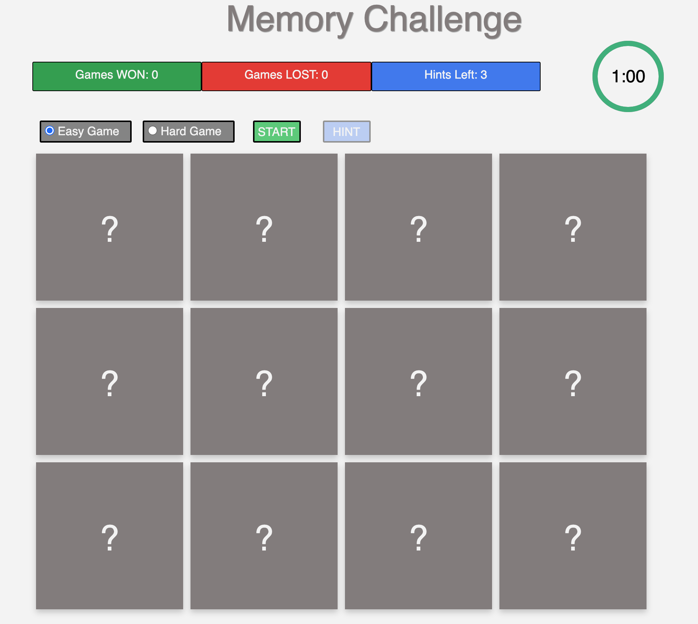

# Mike Magee - Code Institute Milestone 2 Memory Game

The requirement of this project is to "...build an interactive front-end site. The site should respond to the users' actions, allowing users to actively engage with data, alter the way the site displays the information to achieve their preferred goals."

I selected the memory game to leverage the topics in the previous lessons in a fun way.  I attempted to exceed the concepts that were presented for technologies that introduced programmatic user interaction.  Specifically I wanted to be a bit more object oriented. 

My approach was to provide a simple to use game that has a clean presentation with as little distraction as possible to the user. I avoided any type of arcade game confusion. 

 
***
## UX 

### User goals 
* A game that is simple to approach and use. 
* Controls and interactions that are familiar and predictable.
* Responsive across device types.
* Somewhat fun. 

### User Stories 
* As a user I expect the game to be fun
* As a user I expect to be able to use the game without instruction
* As a user I expect the interaction to be crisp and predictable
* As a user I expect the game to be challenging enough to capture my attention but easy enough be derive satisfaction 
* As a user I want to be able to observe my success / failure and measure my improvement. 

  

*** 
Hosted game
The game is published at https://michaelmagee.github.io/magee-ms2/
***
Wireframes for usability on different devices

- [Initial idea](project/FirstDrawing.png)
- [Small Device](project/iPhone.png)
- [Medium Device](project/iPad.png)
- [Large Device](project/LargescreenDesktop.png)

## MINIMUM Features (Must Have) 
- **Simple Interface**: Must have a simple interface free of distraction and complexity 
- **Multi Level**: Should have at least 2 levels - easy & hard
- **Game timer/progress bar**: Counts down the remaining time left to win or lose the game
- **Indication of win or lose**: An visual presentation of win or lose when the timer ends
- **Win/Loss/total games Counters**:A running total of games played, won and lost
- **Good visual clues**:Good indications of cards being selected
- **Consistent and predictable controls**:Game controls should be disabled when they are not in context of game at that moment

    
***

## STRETCH Features (Nice to have) 
- **Hint**: The user will be able to click a "Hint" button after the first car selection that will Visually indicate ("Jiggle") the matching card and one that does not match to select from. 

  
*** 

## DEFERRED Features (Wish I could, maybe I will) 
- **Email feedback**: User will be able to send a feedback form via email to me
- **Automated testing**: Jasmine test for object methods
- **Refactor Board class**: I would like to have used the get / set as I did in the Card Class 

  *** 

## What I learned 
- **Javascript Classes**: I had the hardest time understanding the use of addEventListener('click', this) within class methods.  I tried dozens of class method approaches, arrow functions.  Class methods lost addressability, arrow functions could not be removed or disabled. 

Eventually, I found the handleEvent(event) {} which made it work as I expected. But it cost DAYS of trial and error. 

I would have liked to find an opportunity to employ a promise but found that setTimeout was adequate for the minor synchronous things. 
  
***
## Technologies Used

In this section, you should mention all of the languages, frameworks, libraries, and any other tools that you have used to construct this project. For each, provide its name, a link to its official site and a short sentence of why it was used.

- JQuery to simplify DOM manipulation.
    - https://jquery.com)
- HTML Validation by freeformatter 
    - https://www.freeformatter.com/html-validator.html
- CSS Validation by W3C
    - https://jigsaw.w3.org/css-validator/
- Development framework Visual Studio Code (mac) by Microsoft v1.47.1
    -https://visualstudio.microsoft.com/vs/mac/
- Bootstrap 4.5.0
   - https://getbootstrap.com/docs/4.5/getting-started/introduction/
- Javascript 
    - https://www.javascript.com/
- Github
    - https://https://github.com/
- Github Pages (Hosts the project)
    - https://pages.github.com/

******
## Testing 

There should be no visible difference in behavior between browsers.  I have tested with:  
- Chrome Version 81.0.4044.122
- Firefox Version 75.0 (64-bit)
- Safari Version 13.0.5 (15608.5.11)

All tests described below have worked successfully across all browsers.
Responsiveness checks have been run by using the Chrome developers's tools as well as manually resizing the windows  

1. I found that the media queries and card sizing really needed some adjustment to produce a 4X3 at full screen sizes 
2. I found a minor timing issue with hint target wiggle ending a tad early.  Could not figure it out in time.
3. Before and between games I would have like to remove the hover p-class for the cards but could not figure out how.  
4. I found I was weakest in responsive design techniques.

Key to matrix: 
* CB = Chrome Browser, CIPH = Chrome iPhone, CPAD = Chrome iPad			
* FFB = Firefox Browser, FFIPH = Firefox iPhone, FFPAD = Firefox iPad			
* SB = Safari Browser, SIPH = Safari iPhone, SPAD = Safari iPad	

| Feature                                          | CB | CIPH | CPAD | FFB | FFIPH | FFPAD | SB | SIPH | SPAD | Notes                                                 |
|--------------------------------------------------|----|------|------|-----|-------|-------|----|------|------|-------------------------------------------------------|
| Pregame- only start and game type enabled        | ✅  | ✅    | ✅    | ✅   | ✅     | ✅     | ✅  | ✅    | ✅    |                                                       |
| Start changes to restart after game done         | ✅  | ✅    | ✅    | ✅   | ✅     | ✅     | ✅  | ✅    | ✅    |                                                       |
| Restart changes to restart after game changes    | ✅  | ✅    | ✅    | ✅   | ✅     | ✅     | ✅  | ✅    | ✅    |                                                       |
| Hint not enabled if one set left                 | ✅  | ✅    | ✅    | ✅   | ✅     | ✅     | ✅  | ✅    | ✅    |                                                       |
| Hint enabled only when one card visible          | ✅  | ✅    | ✅    | ✅   | ✅     | ✅     | ✅  | ✅    | ✅    |                                                       |
| Hint decremented correctly                       | ✅  | ✅    | ✅    | ✅   | ✅     | ✅     | ✅  | ✅    | ✅    |                                                       |
| Hint  disabled when hints depleted               | ✅  | ✅    | ✅    | ✅   | ✅     | ✅     | ✅  | ✅    | ✅    |                                                       |
| Hint selects match and decoy correctly           | ✅  | ✅    | ✅    | ✅   | ✅     | ✅     | ✅  | ✅    | ✅    |                                                       |
| Hint decoy 3 second wiggle terminated if match   | ✅  | ✅    | ✅    | ✅   | ✅     | ✅     | ✅  | ✅    | ✅    |                                                       |
| Timer decrements correctly                       | ✅  | ✅    | ✅    | ✅   | ✅     | ✅     | ✅  | ✅    | ✅    |                                                       |
| Won/LOST increments correctly                    | ✅  | ✅    | ✅    | ✅   | ✅     | ✅     | ✅  | ✅    | ✅    |                                                       |
| Card clicks disabled during animation and wiggle | ✅  | ✅    | ✅    | ✅   | ✅     | ✅     | ✅  | ✅    | ✅    |                                                       |
| Card shuffle appears correct                     | ✅  | ✅    | ✅    | ✅   | ✅     | ✅     | ✅  | ✅    | ✅    |                                                       |
|                                                  |    |      |      |     |       |       |    |      |      |                                                       |
| Responsiveness                                   | 🆇 | ✅    | ✅    | 🆇  | ✅     | ✅     | 🆇 | ✅    | ✅    | Unable to solve the row length bug in desktop browser |

## Deployment

This sample site is set up to use git pages based on the current code version in Github.  Github pages is enabled by going to the settings tab of the github project and enabling github pages.    Github Pages uses the current version of the codeline to serve the application up and is always accessible.  

- Pages location is: https://michaelmagee.github.io/magee-ms2/

This sample site can easily edited and run locally in the VSCode IDE by using the GoLive feature, which is how this code was developed.  To do this:
- From a terminal in the appropriate location clone a copy of the code locally: 
    - run: `git clone https://github.com/michaelmagee/magee-MS2.git`
    - then run `git remote rm origin` to remove the remote references to github.
- Then from VSCode, open a new window and open the newly cloned directory.   The Go Live button is on the bottom right.
### Gitpod Reminders

To run a frontend (HTML, CSS, Javascript only) application in Gitpod, in the terminal, type:

`git pull`   To be sure that the code is current
`python3 -m http.server`  

A blue button should appear to click: *Make Public*,

Another blue button should appear to click: *Open Browser*.

## Credits
- Organizational and planning support from Mentor Brian M.  
- Attempted color inspiration from color.adobe.com
- Table of contents generated with markdown-toc: http://ecotrust-canada.github.io/markdown-toc/  
- Thank you Rik Schennink https://dev.to/rikschennink/the-fantastically-magical-handleevent-function-1bp4 for providing insight into event listener management within classes.  I was stuck for 4 days wresting with class level addEventListener/removeEventListener without ever knowing about handleEvent.
- Cool Excel to markdown utility by DaveJ: https://thisdavej.com/copy-table-in-excel-and-paste-as-a-markdown-table/

### Environment 
- Code Institute student template for Gitpod was used
- Locally, Visual Studio Code, periodically pushing to Githib/Gitpod

### Content
- All text and images are mine.

### Media
-  Fav Icon by https://icons8.com/icons/set/question-mark

### Acknowledgements

- I received inspiration for this project from examples from Code Institute that I played with as I was learning.  
- Memory Game and animation tutorials from Adam Khoury
- Javascript class usage tutorials NetNinjas
- Rational approach to simple shuffle approaches: https://stackoverflow.com/questions/2450954/how-to-randomize-shuffle-a-javascript-array   I selected the Fisher-Yates (aka Knuth) Shuffle
- Cool animated timer (modified to a class by me, but thank you "Mateusz Rybczonec"!) https://css-tricks.com/how-to-create-an-animated-countdown-timer-with-html-css-and-javascript/  